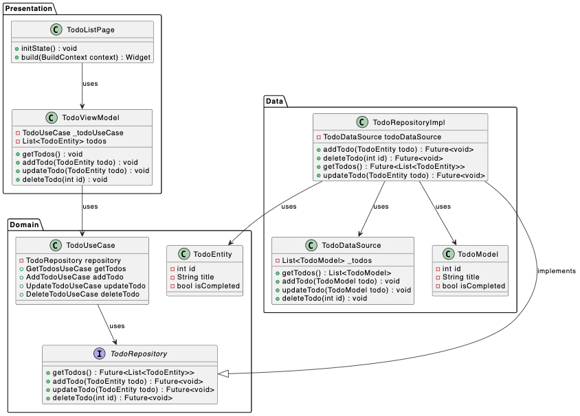

# todo_list

`todo_list` là một ứng dụng Flutter đơn giản tuân theo nguyên lý của Clean Architecture. Nó triển khai một ứng dụng To-Do List cơ bản với khả năng thêm, cập nhật và xóa các mục To-Do.

## Cấu trúc dự án

Mã nguồn của ứng dụng được tổ chức thành ba lớp chính: Data, Domain và Presentation. Dưới đây là cấu trúc thư mục của dự án:

```
- lib
  - main.dart
  - injector.dart
  - src
    - data
      - model
        - todo_model.dart
      - data_sources
        - todo_data_source.dart
      - repositories
        - todo_repository_impl.dart
      - transfers
        - todo_transfer.dart
    - domain
      - entities
        - todo_entity.dart
      - repositories
        - todo_repository.dart
      - use_cases
        - todo_use_case.dart
    - presentation
      - pages
        - todo_list_page.dart
        - todo_view_model.dart
```

## Kiến trúc ứng dụng

Ứng dụng tuân theo nguyên tắc Clean Architecture. Mô hình kiến trúc được thể hiện rõ ràng qua sơ đồ dưới đây:



Mỗi lớp trong ứng dụng có một nhiệm vụ rõ ràng:

- Lớp `Data`: Chịu trách nhiệm cho việc lưu trữ và truy xuất dữ liệu. Trong dự án này, dữ liệu được lưu trữ dưới dạng mock data.
- Lớp `Domain`: Định nghĩa các business logic và business entities. Lớp này hoàn toàn không phụ thuộc vào bất kỳ lớp nào khác trong hệ thống, đảm bảo tính độc lập và tái sử dụng cao.
- Lớp `Presentation`: Chịu trách nhiệm cho việc hiển thị giao diện người dùng và tương tác với người dùng.

`Injector` đóng vai trò làm cầu nối giữa các lớp, đảm bảo việc khởi tạo và cung cấp các dependencies cho các lớp khác một cách linh hoạt và hiệu quả.